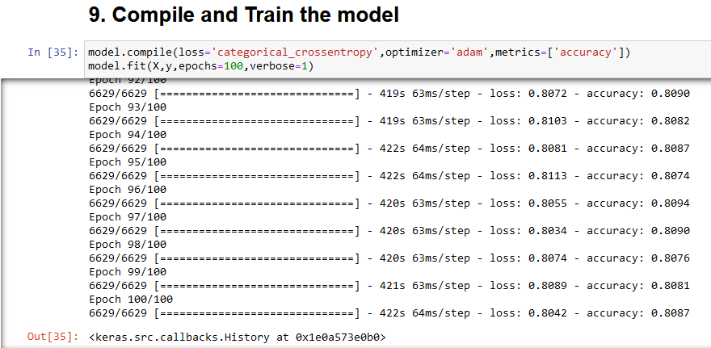
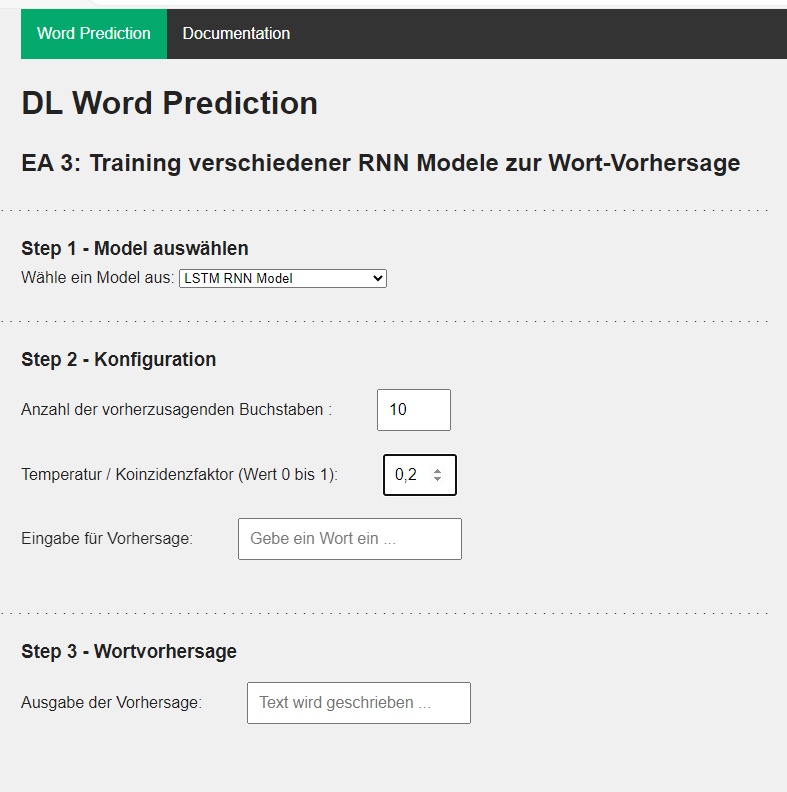

# Deepl Learning Projects
## Training a language model 
In this project a simple language model is created to perform a 'next word prediction'.

During this process I experimented with different methods.
### 1. Jupyter Notebooks and Data
To start with a prototype for easy and fast setup I used a Jupyter notebook to process different input data, build up a methode and workflow to create a first language model for a word prediction. 
This model is of the type Long short-term memory (LSTM) network, which is a specific version of a recurrent neural network (RNN), aimed to deal with the vanishing gradient problem present in traditional RNNs.
  
  
<i>Image1: Details and structure of the LSTM network.</i>  

 
<i>Image2: Loss and accuracy values of the LSTM network.</i>  

 
<i>Image3: First 7 word prediction with input text 'Die Gräfin'.</i>  

Please, find the corresponding Jupyter notebook in the folder: `jupyter/next_word_prediction.ipynb`
The text files that are used as data sources for the training of the different models are free books from the [Gutenberg Project](https://archive.org/details/gutenberg?and%5B%5D=mediatype%3A%22texts%22&and%5B%5D=language%3A%22German%22&and%5B%5D=collection%3A%22gutenberg%22) in Germany language.
The data files can be found in the folder: `data/`

### 2. Python and Tensorflow
Construction of the model and raining was done with python and tensorflow / keras.
The model then was converted from the keras format to a json file format using the tensorflow_converter commandline tool.
This step is needed in order to use the model on a JavaScript website, using tensorflowjs to show the functionality of the model and predict the next word(s) of a user input.

As a reference for performance and prediction accuracy, I implemented a 'algorithmic' version of the 'next word prediction' task in python.
I used numeric tokens for the different words, like it is done in preprocessing for the DL (LSTM RNN) solution, but mainly worked with dictionary data structures and keys. The keys each linking to the corresponding next word(s), which could have multible candidates that would have a score representing the likelihood of being the next word. To simulate the 'temperature' coefficient (for highter/lower randomness) in the prediction, the next word would be more or less randomly picked among the matches, depending on the chosen 'temperature' value. 
Please, find this solution in the folder: `python/chatGPT_v3.py`

### 3. JavaScript and HTML
The above process was not running smoothly, so I decided to step out into (for me at this time) unknown territory, and rebuild the whole setup and model with tensorflow.js.
This made it easier to showcase the models performance on a website afterwards.
Therefor, the final result of this project can be seen by running the `index.html` file in your browser (Firefox v121.0, Chrome v120.0, Edge v120.0 are tested) 
or [click here >>](https://deeplearning-playground-quosi-ca1b2d1bc2440c1270a479bdc50185043.gitlab.io/)
  
 
<i>Image4: Website of this project to try out the next word prediction.</i> 